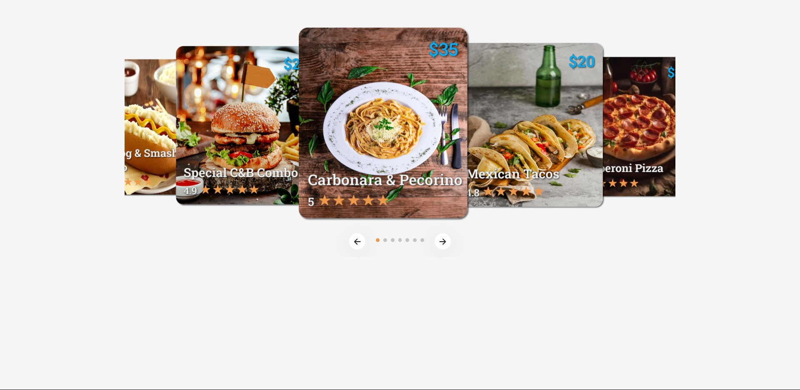

# Carrosel Slider

Deploy: https://carrosel-slider-rho.vercel.app/

Youtube: https://youtu.be/cTXZNAnHpdc?si=oPsgezsYD22mniH0

## Sobre

É um slider tipo carrosel com imagens de comida e com avaliação. Como tema coloquei os meus 7 pratos de comida favoritos.

### Objetivos

Aprender como funciona a criação de um slide carrosel interativo com várias imagens e efeitos 3D.

### Desafio

É a primeira vez que pratico o desenvolvimento de um carrosel de imagens interativo. Achei bem complexo o número de classes que foi preciso para que assim o cartão pudesse ter vários detalhes.

### Conclusão

Consegui aprender muitas coisas com esse projeto, principalmente na organização de div´s e também alguns atalhos do CSS que até então eu desconhecia. O vídeo que utilizei foi do canal "cods" localizado no Youtube ( https://youtu.be/li-ylRo7VEc?si=a2eyPYztriRk1m3P ).

### Ferramentas Utilizadas

- HTML
- CSS
- Javascript